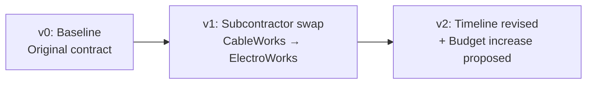
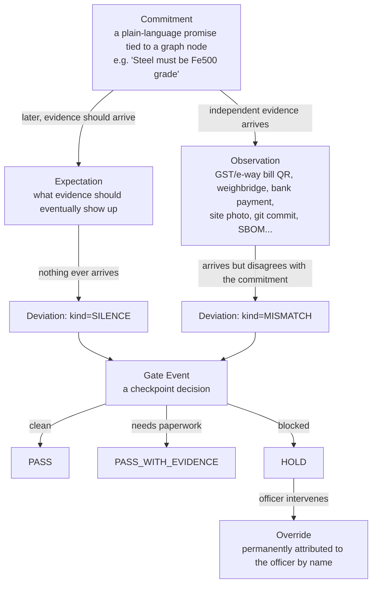
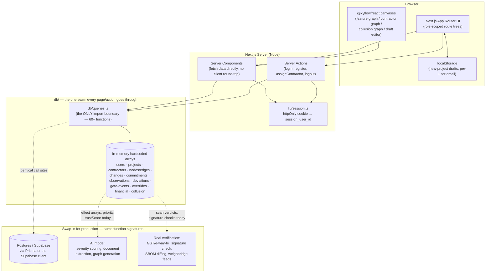
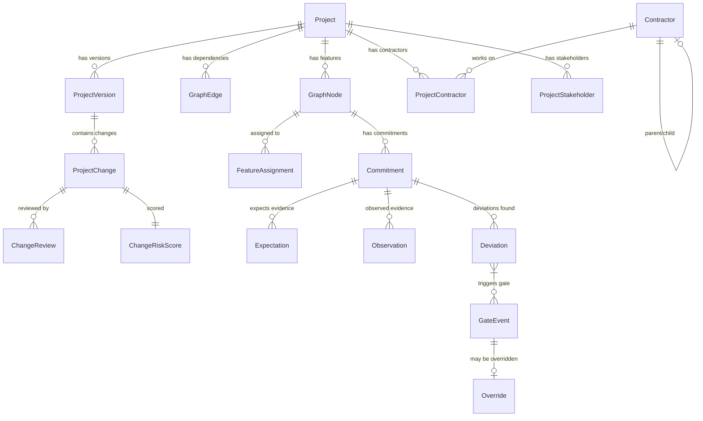
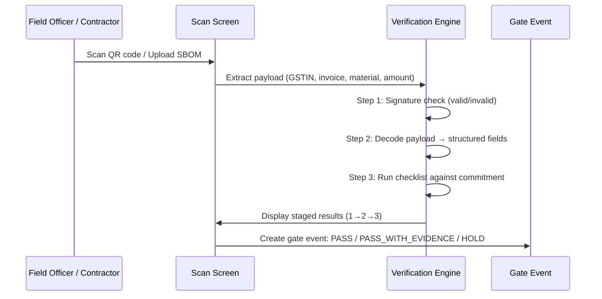
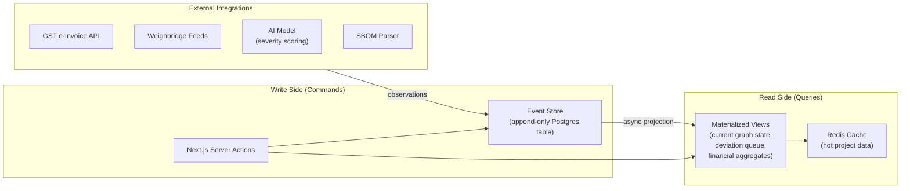
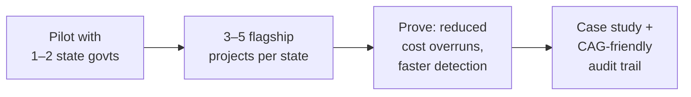
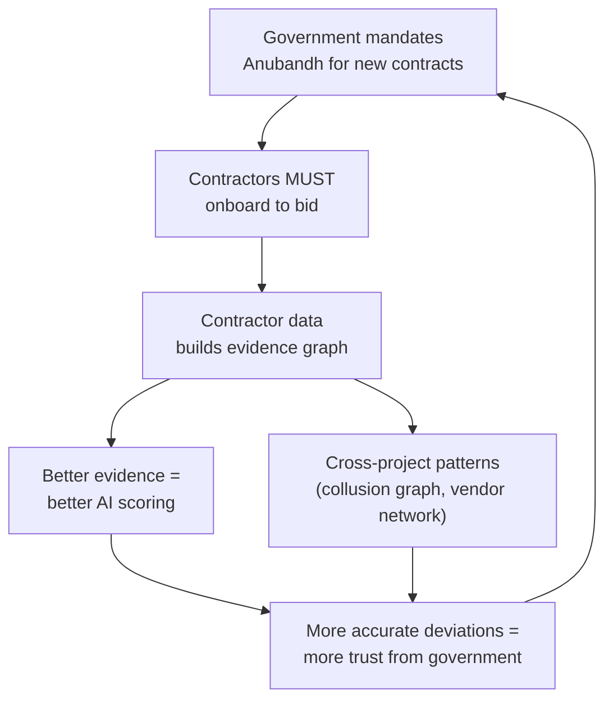

# ANUBANDH — Presentation Deck

**अनुबंध** — *Contract. Commitment. Binding Agreement.*

> A public contract is a binding promise between the state and a contractor.
> This system's job is watching what happens to that promise after the ink dries.

---

# SLIDE DECK OUTLINE

| # | Section                   | Slides |
| - | ------------------------- | ------ |
| 1 | Problem Statement         | 1–3   |
| 2 | Solution Overview         | 4–9   |
| 3 | USPs & Differentiators    | 10–12 |
| 4 | Technical Implementation  | 13–22 |
| 5 | Feasibility & Scalability | 23–28 |
| 6 | Business Strategy         | 29–36 |
| 7 | Demo Flow & Close         | 37–38 |

---

---

# SECTION 1 — THE PROBLEM

---

## Slide 1 · The Landscape

### India's ₹25 Lakh Crore Problem

India's annual public procurement is valued at **₹20–25 lakh crore** (~15–24% of GDP). As of March 2026, MoSPI reports that **1,941 central-sector infrastructure projects** (each ≥ ₹150 Cr) have accumulated a combined cost overrun of **₹5.61 lakh crore** — revised costs of ₹41.50 lakh crore against original estimates of ₹35.89 lakh crore.

> **Not every overrun is fraud. But without visibility, nobody knows which ones are.**

---

## Slide 2 · The Problem Statement (verbatim)

**Track:** Smart Governance & Compliance — *"Unverified Post-Award Subcontractor Variations"*

> Public contracts are often evaluated in detail before award, but projects
> can change substantially during execution. Contractors or subcontractors
> may change, materials or costs may shift, and timelines or project details
> may be revised. When these changes are difficult to track against the
> original commitment, authorities may lack a clear view of whether the
> project remains aligned with what was approved…

**The solution should support oversight without assuming that every change is improper.**

---

## Slide 3 · The Three Open Questions

| Question the brief leaves open                     | Our answer                                                                                                   |
| -------------------------------------------------- | ------------------------------------------------------------------------------------------------------------ |
| What constitutes a**meaningful variation**?  | Every change is scored on a**1–5 effect scale** (AI-driven in production, hand-authored in prototype) |
| How are changes**detected and represented**? | A**project feature graph** (DAG), not a flat log — every change is a diff against that graph          |
| How is**evidence connected**?                | A**Commitment → Observation → Deviation** pipeline tied to independently-sourced evidence            |
| How is**review priority determined**?        | A deterministic, inspectable formula — priority always shows its work                                       |
| **Oversight without accusation**             | Nothing is labelled "fraud." Levels: Cosmetic → Minor → Material → Critical → Integrity                  |

---

---

# SECTION 2 — THE SOLUTION

---

## Slide 4 · One-Line MVP

> ### Track changes.

Everything else — the contractor hierarchy graph, the commitment/evidence pipeline, the collusion graph, the financial triple-entry view, the gate-scan screen — was brainstormed *around* that one sentence, to answer:

**"Track changes *for whom*, *using what evidence*, and *with what consequence*?"**

---

## Slide 5 · The Core Feature — Visual Project Graph

```
┌──────────────────────────────────────────────────┐
│           ◉ Riverside Metro Extension            │  ← PROJECT root
│                    (45%)                         │
├──────┬──────────┬────────────────┬───────────────┤
│      │          │                │               │
│  ◉ Foundation   ◉ Elevated     ◉ Electrical    ◉ Drainage
│  (100%)    ✓    Track (60%)    System (30%)    (0%)
│                      │              │
│                      │         ◉ Traction
│                      │         Wiring (100%) ✓
│                 [subcontracted
│                  to ElectroWorks]
└──────────────────────────────────────────────────┘
```

Every project is a **Directed Acyclic Graph (DAG)** of features, not a document:

- **Nodes** = features/subfeatures with status, progress, due dates, free-form metadata
- **Edges** = dependency relationships (source → target means "target depends on source")
- **Subcontractor clusters** = nodes handed off to a sub are enclosed in a draggable box
- Rendered with **@xyflow/react**, auto-laid-out by **dagre** — zero hand-placed coordinates

---

## Slide 6 · Version Control — Like Git, Not Like Snapshots



Changes are **append-only** — `v0` is the original baseline, and every change creates a new version pointing at its parent. Nothing is ever overwritten; the "current" state is the tip of the chain.

> **We don't snapshot the entire project for every change.**
> We record *what changed, who changed it, when, and which node(s) it touched* — the same principle as `git`. Storage is O(changes), not O(project-size × changes).

### Visual diff on the graph itself

| Node colour | Meaning                        |
| ----------- | ------------------------------ |
| 🟥 Red      | Dramatic change (effect = 5)   |
| 🟧 Orange   | Significant / Moderate (3–4)  |
| 🟨 Yellow   | Minor (2)                      |
| 🟩 Green    | Unchanged or negligible (0–1) |

Two comparison modes: **"Compare with Original"** (worst severity across the entire chain) and **"Compare with Last Change"** (most recent step only). Clicking any entry in the history list shows the graph *at that point in time*.

---

## Slide 7 · The Compliance Pipeline



Five stages, each a distinct data entity with clear input→output:

1. **Commitment** — what was promised (tied to a graph node, with criticality + tolerance band)
2. **Observation** — independently-sourced evidence (GST QR, weighbridge, bank record, GPS, lab cert, git commit, SBOM)
3. **Expectation** — what evidence *should* have arrived by now (SILENCE = nobody reported anything)
4. **Deviation** — where promise and evidence disagree (MISMATCH, SILENCE, or PROMOTED)
5. **Gate Event** — go/no-go decision, especially at irreversible moments (concrete pour, production deploy)

---

## Slide 8 · Three Roles

```
┌─────────────────────────────────────────────────────────────┐
│                                                             │
│  STAKEHOLDER          CONTRACTOR           INSPECTOR        │
│  ─────────────        ──────────           ─────────        │
│  Awarding authority   Awarded party        Independent      │
│                                            oversight        │
│  • Creates projects   • Executes features  • Sees every     │
│  • Awards contractor  • Subcontracts work    project        │
│  • Reviews changes    • Scans invoices/QR  • Works the      │
│  • Sees compliance    • Reports progress     deviation      │
│    layer                                     queue          │
│                       A subcontractor is    • Can override   │
│                       NOT a 4th role —        a gate, but    │
│                       it's a Contractor      it's audited    │
│                       whose parent-                          │
│                       ContractorId ≠ null                    │
│                                                             │
└─────────────────────────────────────────────────────────────┘
```

Each role gets its own route tree, its own sidebar, and its own filtered view of the same underlying data.

---

## Slide 9 · Key Feature Screens

| Screen                       | What it does                                                                                               |
| ---------------------------- | ---------------------------------------------------------------------------------------------------------- |
| **Project Graph**      | Interactive DAG with click-to-inspect, drag, collapse, severity colouring                                  |
| **Contractor Details** | Contractor hierarchy*as a graph* — who hired whom, what each is responsible for                         |
| **New Project Editor** | Dual graph + list editor with AI-assisted generation (prompt → preview → insert)                         |
| **Gate Scan**          | Staged QR/SBOM verification: signature check → decoded payload → pass/fail checklist → gate decision    |
| **Deviation Queue**    | Cross-project priority queue — worst case on top, cosmetic hidden by default                              |
| **Case File**          | Promised vs. observed, trust note, priority breakdown — every number shows its work                       |
| **Financial View**     | Triple-entry (money, material, labour) with claim gap and diverging curves                                 |
| **Collusion Graph**    | Shared directors, shared addresses, losing bidders reappearing as undisclosed subs                         |
| **Commitment Review**  | The only screen a human configures the system from — ~10 min per contract                                 |
| **Public Page**        | Unauthenticated citizen view — committed vs verified counts, open critical cases, "report a concern" form |
| **Override Audit**     | Tallies overrides per officer — the system watches its own reviewers too                                  |

---

---

# SECTION 3 — USPs & DIFFERENTIATORS

---

## Slide 10 · What Makes This Different

### 1. Graph, Not Document

Most contract-tracking systems store projects as flat documents or spreadsheets. Anubandh represents them as **interactive directed acyclic graphs** — the same data structure `git` uses — so relationships, dependencies, and the *impact radius* of a change are immediately visible, not buried in cells.

### 2. Evidence That Isn't Self-Reported

The system *deliberately favours* evidence sources the contractor **cannot author themselves**: GST e-invoice QR codes, weighbridge readings, bank payment records, equipment GPS pings, lab certificates, git commits, SBOMs. A contractor-submitted photo is explicitly labelled *"corroboration only."* Every observation carries a **trust score** and a **trust label** — a reviewer always sees *why* evidence is or isn't convincing.

### 3. Catches Silence, Not Just Lies

Two deviation types: **MISMATCH** (evidence contradicts the commitment) and **SILENCE** (expected evidence simply never arrived). A "flag if it looks wrong" system only catches mismatches. Anubandh catches the dog that *didn't* bark.

### 4. Watches Its Own Reviewers

An inspector can override a HOLD, but the override is **permanently attributed** by name, hashed into a chain, and tallied on a separate **Override Audit** page. A system that watches only contractors has just moved the fraud channel one level up.

---

## Slide 11 · More Differentiators

### 5. Oversight Without Accusation

Nothing is ever labelled "fraud." Severity levels: Cosmetic → Minor → Material → Critical → Integrity. Low-severity changes render calm and green, not alarming. The **design language deliberately avoids red flags and warning symbols at low levels** — because a system that cries wolf on every paint-colour change trains users to ignore it.

### 6. Domain-Agnostic by Construction

`GraphNode.metadata` is a free-form key/value bag. The same schema works whether the field says `"material": "Fe500 steel"` or `"technology": "OAuth2"`. The demo proves this: `project-4` (a software contract) runs through the **exact same screens** as `project-1` (hospital construction) — deviation queue, case file, gate scan, financial view — with zero domain-specific code.

### 7. PROMOTED Deviations — The Aggregate Signal

14 cosmetic finish downgrades that, individually, nobody would flag. Together, they add up to **₹18.2 lakh** of material substitution. The system rolls them into a single L2 **PROMOTED** deviation — catching the pattern that single-event monitoring misses.

### 8. Deterministic, Inspectable Priority

Every priority number *shows its work*: `"criticality STRUCTURAL ×4.0, magnitude 1.0, value at risk ₹1.42 Cr, recurrence ×1.2, ÷ 3.8 hours remaining = 91.4"` — never an opaque score.

---

## Slide 12 · The Version Control Analogy

| Concept                 | Git                                       | Anubandh                                                       |
| ----------------------- | ----------------------------------------- | -------------------------------------------------------------- |
| **Unit of truth** | Source code files                         | Project feature graph (DAG of nodes + edges)                   |
| **Baseline**      | Initial commit                            | `v0` — the original contract                                |
| **Change record** | Commit (diff, author, timestamp, message) | `ProjectChange` (field, old→new, author, timestamp, reason) |
| **Version chain** | Commit DAG (parent pointers)              | `ProjectVersion` chain (parentVersionId)                     |
| **Visual diff**   | `git diff` — red/green lines           | Graph nodes light up red→green by severity                    |
| **Storage model** | O(changes), not O(repo × changes)        | O(changes), not O(project × changes)                          |
| **Review**        | Pull request → approve/reject            | `ChangeReview` → APPROVED / REJECTED / NEEDS_EVIDENCE       |
| **Risk score**    | CI/CD checks                              | Deterministic formula (spec §46) per change                   |

> **We didn't reinvent version control. We applied its principles to contract oversight.**

---

---

# SECTION 4 — TECHNICAL IMPLEMENTATION

---

## Slide 13 · Tech Stack

| Layer                       | Technology                                                                               | Why                                                                                            |
| --------------------------- | ---------------------------------------------------------------------------------------- | ---------------------------------------------------------------------------------------------- |
| **Framework**         | Next.js 16 (App Router, Turbopack), React 19, TypeScript                                 | Server Components eliminate API layer; type safety prevents category errors                    |
| **Styling**           | Tailwind CSS v4                                                                          | CSS-driven theming, zero runtime, atomic classes                                               |
| **Graph Rendering**   | `@xyflow/react` (React Flow)                                                           | Production-grade interactive canvas — pan, zoom, drag, click, connect                         |
| **Auto-Layout**       | `@dagrejs/dagre`                                                                       | Real hierarchical layout algorithm (rank + crossing-minimization), not hand-placed coordinates |
| **Icons**             | `lucide-react`                                                                         | Tree-shakable, consistent stroke-based icon set                                                |
| **Auth**              | Cookie-based session (`httpOnly`), no third-party provider yet                         | Simple, secure-enough for prototype; swap-in for Supabase Auth / Clerk trivially               |
| **Data Layer**        | In-memory TypeScript arrays under`db/`, single query-function seam (`db/queries.ts`) | Every page imports ONLY from`db/queries.ts` — swap the file, swap the backend               |
| **Draft Persistence** | Browser`localStorage`, keyed per user email                                            | Stakeholder can close tab mid-draft and pick up exactly where they left off                    |

---

## Slide 14 · Architecture Diagram



> **Why this matters:** every page and server action imports ONLY from `db/queries.ts`. The entire hardcoded prototype can be replaced by a real database + real AI model behind that one file, without touching a single page component.

---

## Slide 15 · Route Structure

```
app/
├── login/, page.tsx              (landing page IS the login/register form)
├── contractor/
│   ├── projects/, profile/, settings/, notifications/
│   └── project/[projectId]/
│       dashboard · daily-reports · project-graph · stakeholder-details ·
│       subcontractors · changes · gate-scan · bill-scan · bills ·
│       notifications · settings
├── stakeholder/
│   ├── projects/, new-project/, profile/, settings/, notifications/
│   └── project/[projectId]/
│       dashboard · daily-reports · project-graph · contractor-details ·
│       changes · financial · commitments · bill-scan · bills ·
│       notifications · settings
├── inspector/
│   ├── projects/, deviations/, override-audit/, collusion/
│   └── project/[project_id]/
│       changes · graph · deviations · deviations/[deviationId] ·
│       expectations · financial · timeline · evidence · gate/[id]/override ·
│       bill-scan · bills
└── public/[projectId]/                ← outside all three role trees, no auth
```

Three role-scoped route trees, each gated by a session cookie check in their top-level `layout.tsx`.

---

## Slide 16 · Graph Algorithms — Dagre Layout

### The Problem

A project graph can have dozens of interconnected nodes. Laying them out by hand is impossible at scale.

### The Solution: Dagre

`@dagrejs/dagre` implements the **Sugiyama framework** for hierarchical graph drawing:

1. **Rank assignment** — assign each node a layer (rank) based on longest-path from root
2. **Crossing minimization** — reorder nodes within each rank to minimize edge crossings
3. **Coordinate assignment** — assign x/y positions with configurable node spacing and margins

### Two layout directions, deliberately chosen

| Graph                | Direction                         | Why                                                                       |
| -------------------- | --------------------------------- | ------------------------------------------------------------------------- |
| Feature graph        | `rankdir: "BT"` (bottom-to-top) | Root is the*sink* — everything points into it → it must render at top |
| Contractor hierarchy | `rankdir: "TB"` (top-to-bottom) | Main contractor is the*source* → it renders at top naturally           |

### `@xyflow/react` Handle Inversion

The two graph types have their `<Handle type="source">` and `<Handle type="target">` elements **deliberately swapped** because their edge directions are opposite. Getting this wrong makes edges loop around the sides of the boxes.

---

## Slide 17 · The Change-Effect Severity System

### Architecture (seam for AI model)

```
┌─────────────────────────┐     ┌──────────────────────────┐
│   lib/graph/             │     │  Production (swap-in)    │
│   change-history.ts      │     │                          │
│                          │     │  AI Model receives:      │
│   Hardcoded array:       │     │  • before-state of node  │
│   [{nodeId, effect: 1-5}]│ ──→ │  • after-state of node   │
│   per change step        │     │  • spec §46 as baseline  │
│                          │     │  Returns: effect 1-5     │
└─────────────────────────┘     └──────────────────────────┘
         ↓                                ↓
┌─────────────────────────────────────────────────────────────┐
│  lib/graph/severity-color.ts                                │
│                                                             │
│  effect 5 → Red (#ef4444)          Dramatic                 │
│  effect 4 → Dark Orange (#ea580c)  Significant              │
│  effect 3 → Orange (#f97316)       Moderate                 │
│  effect 2 → Yellow (#eab308)       Minor                    │
│  effect 1 → Yellow-green (#84cc16) Negligible               │
│  absent   → Green (#22c55e)        Unchanged                │
└─────────────────────────────────────────────────────────────┘
```

The seam is **exact**: same input shape, same output shape. Replace the hardcoded array with a model call — zero UI changes.

---

## Slide 18 · Data Model — Key Entities



**38 TypeScript interfaces** across 17 type files, transcribed from the spec's DB table definitions with deliberate comments where the spec contradicts itself.

---

## Slide 19 · Evidence Source Types (11 channels)

| Source              | Trust Level | Example                                                      |
| ------------------- | ----------- | ------------------------------------------------------------ |
| `GST_IRN_QR`      | High        | Government-signed GST e-invoice QR code                      |
| `EWAY_BILL`       | High        | E-way bill from government portal                            |
| `WEIGHBRIDGE`     | High        | Automated weighbridge reading                                |
| `BANK_PAYMENT`    | High        | Bank transaction record                                      |
| `LAB_CERTIFICATE` | High        | Third-party lab test certificate                             |
| `GIT_COMMIT`      | High        | Cryptographically signed code commit (for software projects) |
| `SBOM`            | High        | Software Bill of Materials (for software projects)           |
| `GATE_CREDENTIAL` | Medium      | Site entry credential scan                                   |
| `ATTENDANCE`      | Medium      | Worker attendance record                                     |
| `EQUIPMENT_GPS`   | Medium      | Equipment geolocation ping                                   |
| `SITE_PHOTO`      | Low         | Contractor-submitted photo —*"corroboration only"*        |

> **Design principle:** the system favours sources the contractor **cannot author themselves.**

---

## Slide 20 · The Priority Formula

```python
score = 0
if budgetIncreasePercent > 20:     score += 30
if deadlineExtensionMonths > 6:    score += 20
if subcontractorChanged:           score += 25
if majorFeatureRemoved:            score += 30
if evidenceMissing:                score += 25
if repeatedChanges:                score += 15

# 0–29 LOW  ·  30–59 MEDIUM  ·  60+ HIGH
```

Every deviation renders its full breakdown:

> *"criticality STRUCTURAL ×4.0, magnitude 1.0, value at risk ₹1.42 Cr, recurrence ×1.2, ÷ 3.8 hours remaining = **91.4**"*

Deterministic. Inspectable. Reproducible. Never a black-box score.

---

## Slide 21 · The Gate-Scan Verification Flow



Three demo scenarios:

1. **Quarry Q-114** — approved supplier, clean PASS
2. **Shree Balaji Minerals** — wrong supplier GSTIN → HOLD (material-source mismatch)
3. **Diverted consignment** — wrong buyer GSTIN → HOLD (diversion)
4. **(Software)** — SBOM with off-India subprocessor → HOLD at production-deploy checkpoint

---

## Slide 22 · What's Real vs. What's Hardcoded

| ✅ Real, working code                                                | 🔧 Hardcoded for demo (seam exists)               |
| -------------------------------------------------------------------- | ------------------------------------------------- |
| Graph rendering, layout, drag, collapse                              | Effect/severity numbers                           |
| Node create/edit/delete in new-project editor                        | Deviation levels, priorities,`timeRemaining`    |
| Contractor award flow + one-time lock                                | Signature/GST/e-way-bill verification results     |
| Route-level access control per role                                  | Trust scores on observations                      |
| Notification creation + inbox                                        | Financial curves, claim gap, CPI                  |
| localStorage draft persistence                                       | Collusion findings and severities                 |
| The`db/queries.ts` data-access seam                                | Override hash/prevHash chain values               |
| Two-stage AI-generation*interaction* (prompt → preview → insert) | AI's actual output (same canned graph every time) |
| `getFeatureAssignmentsForContractor` query                         | Subcontractor's "own project" (demo shortcut)     |

> The seam in every "hardcoded" row above is exactly where a real model call or verification API slots in — the interaction, the data shape, and every screen that renders it are already built.

---

---

# SECTION 5 — FEASIBILITY & SCALABILITY

---

## Slide 23 · Can We Scale to Everyone Using It?

### Yes. Here's why — by layer.

| Layer                     | Current State                      | Production Path                                  | Scalability Pattern                         |
| ------------------------- | ---------------------------------- | ------------------------------------------------ | ------------------------------------------- |
| **Frontend**        | Next.js Server Components          | Same — SSR + edge caching via Vercel/Cloudflare | Horizontally scalable, stateless            |
| **Data access**     | In-memory arrays,`db/queries.ts` | Swap to Postgres/Supabase via Prisma             | Same function signatures, zero page changes |
| **Graph rendering** | Client-side`@xyflow/react`       | Same — runs in user's browser                   | O(nodes) per project, bounded per user      |
| **AI scoring**      | Hardcoded effect arrays            | Model API call (OpenAI/Gemini/Claude)            | Async queue, cache results per change       |
| **Verification**    | Scripted scan scenarios            | Real GST API / SBOM parser / weighbridge feed    | Event-driven microservice                   |
| **Auth**            | Cookie session                     | Supabase Auth / Clerk / OIDC                     | Stateless JWT at edge                       |

---

## Slide 24 · Version Control — The Key Scalability Decision

### What we do (Event Sourcing / Change Log):

```
v0 (baseline) → change-1 → change-2 → change-3 → ... → current state
```

### What we DON'T do (Snapshots):

```
snapshot-v0 (full project) → snapshot-v1 (full project) → snapshot-v2 (full project)
```

| Approach                            | Storage                         | Query cost                                                 | Audit trail                                 |
| ----------------------------------- | ------------------------------- | ---------------------------------------------------------- | ------------------------------------------- |
| **Snapshot per version**      | O(project_size × num_versions) | O(1) for current state                                     | Have to diff snapshots to find what changed |
| **Append-only change log** ✅ | O(num_changes)                  | O(changes) to reconstruct, or O(1) with materialized views | Built-in — the log IS the audit trail      |

This is the **same design decision `git` makes** — and for the same reason: a repository with 10,000 commits doesn't store 10,000 full copies of every file.

### CQRS for read performance

In production, the **Command** side (recording changes) and the **Query** side (rendering the current graph) use separate, optimized models:

- **Write side**: append-only event log (Postgres `JSONB` or a dedicated event store)
- **Read side**: materialized "current state" view, rebuilt incrementally on each change
- **Result**: O(1) reads for current graph, full history always available for audit

---

## Slide 25 · Database Architecture (Production)



### Key design choices:

- **Postgres** as the primary store (JSONB for flexible metadata, native graph queries via recursive CTEs)
- **Row-Level Security (RLS)** via Supabase for multi-tenant isolation
- **Async event projections** so writes are never blocked by read-model updates
- **Redis** for hot data (deviation queue rankings, current graph state)

---

## Slide 26 · Scale Numbers

| Dimension                          | Current Demo  | Production Estimate                              | Bottleneck?                               |
| ---------------------------------- | ------------- | ------------------------------------------------ | ----------------------------------------- |
| **Projects**                 | 5             | 50,000+ (all active central govt projects)       | No — each project is independent         |
| **Users**                    | 9             | 500,000+ (all project participants + inspectors) | No — stateless auth, horizontal scaling  |
| **Nodes per project**        | 5–6          | 50–500 (realistic feature tree)                 | No — dagre handles 1000+ nodes in <100ms |
| **Changes per project**      | 5             | 100–1,000 over lifecycle                        | No — append-only, O(changes) storage     |
| **Graph renders per second** | Client-side   | Client-side (no server load)                     | No — browser handles it                  |
| **AI scoring calls**         | 0 (hardcoded) | 1 per change (cacheable)                         | Async queue — non-blocking               |
| **Verification events**      | 0 (scripted)  | 10–100 per project per month                    | Event-driven — horizontally scalable     |

> **The architectural bottleneck does not exist at the prototype level.** Every layer is designed to scale independently.

---

## Slide 27 · Multi-Tenancy & Security

### Data Isolation

- **Row-Level Security** (Supabase/Postgres RLS) ensures a contractor can only query data for projects they're linked to
- **Role-based route gating** — three separate route trees, each checked at layout level
- **Inspector sees everything** — by design, not by accident (no inspector↔project link table, flagged for future scoping)

### Audit Trail

- Every change is append-only — no `UPDATE`, no `DELETE` on the event store
- Override hash chain: each override carries `hash` and `prevHash` — tamper-evident without a blockchain's overhead
- All actions attributed by user ID and timestamp

### Compliance Readiness

- `httpOnly` cookies prevent XSS-based session theft
- No plaintext passwords in production (prototype-only)
- Graph metadata is user-defined key/value — no PII embedded in schema by default
- Public page never names a party or exposes raw evidence

---

## Slide 28 · Domain Agnosticism — Proven, Not Claimed

| Project                                  | Domain                            | Same codebase? |
| ---------------------------------------- | --------------------------------- | -------------- |
| project-1: Riverside Metro Extension     | Transit Infrastructure            | ✅             |
| project-2: Greenfield Hospital Complex   | Healthcare Infrastructure         | ✅             |
| project-3: Smart Water Distribution      | Utilities Infrastructure          | ✅             |
| project-4: State Citizen Services Portal | **Software / e-Governance** | ✅             |

**Zero domain-specific branching in any component.** The gate-scan screen for `project-4` verifies an **SBOM** (Software Bill of Materials) at a production-deploy checkpoint — the same mechanism that verifies a **GST e-invoice QR** for `project-1`'s aggregate delivery. `GraphNode.metadata` being a free-form key/value bag is what makes this work.

This means Anubandh can cover:

- 🏗️ Construction & Infrastructure
- 💊 Healthcare facility builds
- 🖥️ Software & IT procurement
- ⚡ Energy & utilities
- 🚀 Defence procurement
- 📡 Telecom infrastructure

---

---

# SECTION 6 — BUSINESS STRATEGY

---

## Slide 29 · Market Opportunity

### India's Public Procurement: ₹20–25 Lakh Crore / year

```
                    ┌─────────────────────────────────┐
                    │    Total Public Procurement      │
                    │    ₹20–25 Lakh Crore / year      │
                    │    (15–24% of GDP)               │
                    └──────────┬──────────────────────┘
                               │
              ┌────────────────┼────────────────┐
              │                │                │
     ┌────────┴────────┐ ┌────┴────┐ ┌─────────┴─────────┐
     │ Central Sector   │ │  State  │ │    Municipal &     │
     │ 1,941 projects   │ │ Govts   │ │    PSU contracts   │
     │ (≥₹150 Cr each)  │ │         │ │                    │
     │ ₹41.50L Cr total │ │         │ │                    │
     └─────────────────┘ └─────────┘ └────────────────────┘
```

**Target Addressable Market:** Even at 0.1% of contract value as a platform fee, the TAM on central-sector projects alone is **₹4,150 Crore / year**.

The global GovTech market is projected to reach **$825 billion by 2026**, with India as a major hub. Digital procurement services are growing at **30%+ CAGR**.

---

## Slide 30 · Revenue Model — Hybrid B2G SaaS

| Revenue Stream                     | Model                                                                   | Who Pays        | Rationale                                         |
| ---------------------------------- | ----------------------------------------------------------------------- | --------------- | ------------------------------------------------- |
| **Platform License**         | Annual subscription per department/ministry                             | Government      | Predictable revenue, aligns with annual budgets   |
| **Per-Project Fee**          | Tiered by contract value (₹1Cr–₹100Cr, ₹100Cr–₹1000Cr, ₹1000Cr+) | Government      | Revenue scales with project complexity            |
| **AI Scoring API**           | Usage-based (per change scored, per document verified)                  | Government      | Pay only for what you use — metered, transparent |
| **Contractor Portal**        | Freemium — free for compliance, paid for analytics dashboard           | Contractor      | Large contractor base = network effects           |
| **Certification & Training** | Per-seat, online or in-person                                           | Both            | Builds ecosystem, drives adoption                 |
| **Data Analytics**           | Anonymized benchmarking reports (industry-level, no PII)                | Public/Research | Additional revenue, builds public trust           |

---

## Slide 31 · Go-to-Market Strategy

### Phase 1: Government Pilot (Year 1)



**Strategy:** Partner with reform-minded state governments (e.g., Karnataka, Andhra Pradesh, Rajasthan — all with active e-governance mandates). Start with high-visibility infrastructure projects (metro, hospital, highway). Success metrics: time-to-detect deviations, reduction in cost overruns, inspector efficiency.

### Phase 2: Central Government Adoption (Year 2–3)

- Integration with **GeM** (Government e-Marketplace) and **CPPP** (Central Public Procurement Portal)
- MoSPI integration for automated project monitoring (replace manual tracking of 1,941+ projects)
- CVC (Central Vigilance Commission) endorsement as a compliance tool

### Phase 3: International Expansion (Year 3+)

- Southeast Asia (similar procurement challenges: Indonesia, Philippines, Vietnam)
- African Union (World Bank-funded infrastructure projects)
- UN / multilateral development banks (standardized compliance for funded projects)

---

## Slide 32 · Competitive Landscape

| Competitor                               | What they do                    | Why Anubandh is different                                                                                          |
| ---------------------------------------- | ------------------------------- | ------------------------------------------------------------------------------------------------------------------ |
| **SAP Ariba / Oracle Procurement** | End-to-end procurement suites   | Overkill for post-award monitoring; no graph-based change tracking                                                 |
| **GeM / CPPP**                     | Government e-marketplaces       | Pre-award only — tendering and bidding, not post-award compliance                                                 |
| **ProCore / Autodesk BIM**         | Construction project management | Domain-specific (construction only); no compliance/deviation pipeline                                              |
| **Custom internal tools**          | Spreadsheets, manual reports    | No evidence pipeline, no audit trail, no cross-project prioritization                                              |
| **Blockchain-based solutions**     | Immutable record-keeping        | Expensive, slow, and a solution looking for a problem — our hash chain gives tamper-evidence without the overhead |

### Our moat:

1. **Graph-first architecture** — nobody else represents contracts as interactive DAGs
2. **Evidence pipeline** — independent-source evidence with trust scoring is unique
3. **Domain agnosticism** — construction AND software on the same platform, proven in prototype
4. **"Watches the watchers"** — override audit is architecturally baked in, not an afterthought

---

## Slide 33 · Adoption Flywheel



**Network effect:** every additional project makes the platform *more valuable* for every existing project — collusion detection, vendor benchmarking, and AI training all improve with scale.

---

## Slide 34 · Partnerships & Ecosystem

| Partner Type                       | Who                             | Value Exchange                                                         |
| ---------------------------------- | ------------------------------- | ---------------------------------------------------------------------- |
| **Government agencies**      | CVC, CAG, MoSPI, State PWDs     | Endorsement + mandate adoption → we provide audit-ready dashboards    |
| **GST/e-Invoice API**        | NIC / GSTN                      | Real-time invoice verification → we drive API adoption                |
| **Lab certification bodies** | NABL-accredited labs            | Digital certificate issuance → auto-ingest as observations            |
| **Construction tech**        | Procore, PlanGrid, BIM360       | Import project structure → export compliance data                     |
| **AI/ML providers**          | OpenAI, Google Gemini, Azure AI | Severity scoring, document extraction, graph generation                |
| **Legal/audit firms**        | Big 4 / Indian audit firms      | Compliance consulting + Anubandh training → revenue share             |
| **Development banks**        | World Bank, ADB, AIIB           | Standardized compliance for funded projects → international expansion |

---

## Slide 35 · Risk Mitigation

| Risk                                   | Mitigation                                                                                                                                   |
| -------------------------------------- | -------------------------------------------------------------------------------------------------------------------------------------------- |
| **Long government sales cycles** | Start with state-level pilots (faster procurement), build to central; partner with system integrators already in the space                   |
| **Resistance from contractors**  | Freemium contractor portal — make compliance*easier*, not harder; show that a clean track record on Anubandh helps win future bids        |
| **Data sensitivity**             | On-premise / sovereign cloud deployment option; RLS-based isolation; no PII in metadata schema; public page never names parties              |
| **AI accuracy concerns**         | Deterministic formula as baseline (always inspectable); AI as an*enhancement*, not a replacement — human override is always available     |
| **Regulatory changes**           | Domain-agnostic schema means new compliance requirements are data changes, not code changes — add new commitment types, not new code paths  |
| **Competition from incumbents**  | First-mover advantage in post-award graph-based tracking; open API strategy to integrate with, not replace, existing e-procurement platforms |

---

## Slide 36 · Financial Projections (Illustrative)

| Year         | Stage     | Revenue Model                                        | Projected ARR                           |
| ------------ | --------- | ---------------------------------------------------- | --------------------------------------- |
| **Y1** | Pilot     | 2 states × 3 projects = 6 projects                  | ₹50L–₹1Cr (proof-of-concept pricing) |
| **Y2** | Expansion | 5 states × 10 projects + central pilots             | ₹3–5 Cr                               |
| **Y3** | Scale     | 50+ departments, 500+ projects, AI scoring live      | ₹15–25 Cr                             |
| **Y4** | Maturity  | National mandate consideration, international pilots | ₹50–100 Cr                            |
| **Y5** | Platform  | Full SaaS + contractor network + data analytics      | ₹200+ Cr                               |

**Key metric to watch:** *Cost savings demonstrated per rupee spent on platform* — if Anubandh helps detect even 1% of the ₹5.61 lakh crore in overruns, the ROI is astronomical.

---

---

# SECTION 7 — DEMO & CLOSE

---

## Slide 37 · Demo Running Order

| #  | Screen                                 | What to show                               | Talk track                                                                                    |
| -- | -------------------------------------- | ------------------------------------------ | --------------------------------------------------------------------------------------------- |
| 1  | Commitment review                      | Stakeholder configures 5 commitments       | "This is the only point a human configures the system, and it takes ~10 minutes per contract" |
| 2  | Gate scan (clean)                      | Approved quarry → PASS                    | "A delivery arrives, contractor scans the QR"                                                 |
| 3  | Gate scan (fraud)                      | Wrong supplier → HOLD, 3h 49m remaining   | "Same screen, same mechanism — but the GSTIN doesn't match"                                  |
| 4  | Deviation queue                        | HOLD at top, cosmetic hidden               | "The inspector opens their queue — worst case first"                                         |
| 5  | Case file                              | Promised vs observed, trust note, priority | "Every number shows its work"                                                                 |
| 6  | Expectations                           | Missing lab certificate (SILENCE)          | "Nobody reported anything — that's the deviation"                                            |
| 7  | Financial view                         | 19-point claim gap, diverging curves       | "Money moved, material delivered, but no work observed"                                       |
| 8  | Collusion graph                        | Losing bidder as undisclosed sub           | "A bidder who*lost* the tender reappears as a subcontractor"                                |
| 9  | Switch to project-4                    | Same screens, zero domain-specific code    | "This is a software contract — same pipeline, no code changes"                               |
| 10 | Override                               | Named accountability, then audit page      | "The system watches its own reviewers"                                                        |
| 11 | Project Graph — Compare with Original | Nodes light up red→green                  | "The whole pipeline exists to answer*why* this node is red"                                 |

---

## Slide 38 · Closing

### अनुबंध — *The binding agreement*

> A public contract is a promise. Anubandh watches what happens to that promise.

**What we built:**

- A **graph-first** change tracking system for public contracts
- An **evidence pipeline** that doesn't trust contractor self-reporting
- A **version control** model that stores changes, not snapshots
- A platform that **watches its own reviewers**, not just the reviewed
- A system that works across **any domain** — construction, software, healthcare, utilities

**What we need:**

- A pilot government partner
- Real GST API + weighbridge + lab cert integrations
- An AI model to replace our hand-authored severity scores

**The architecture is ready. The seams are built. The screens are waiting.**

---

*Built for Smart Governance & Compliance — Manipal Hackathon 2026*
