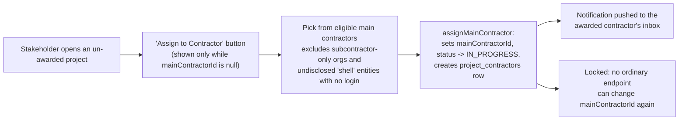
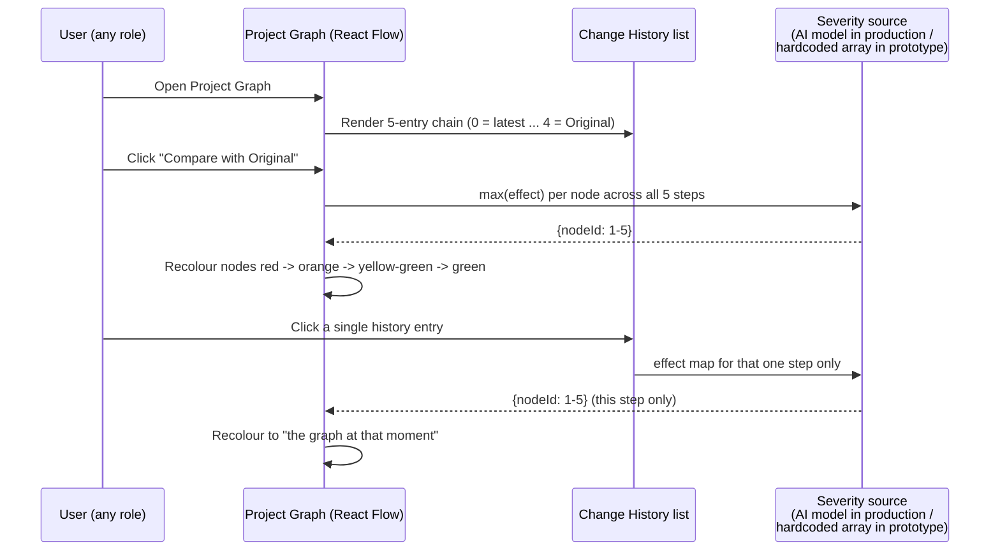
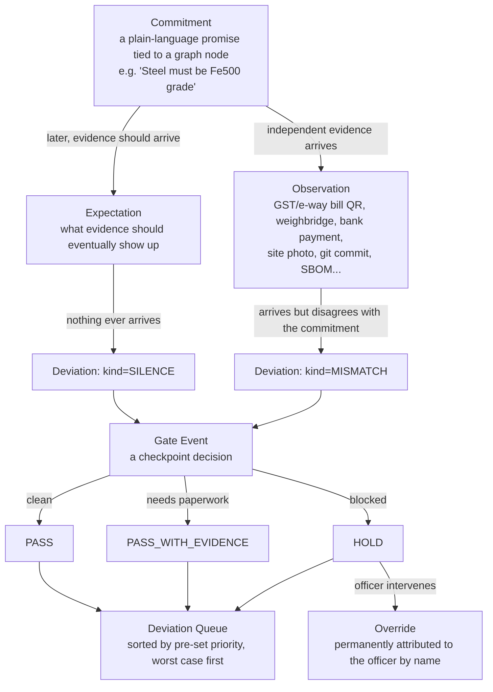
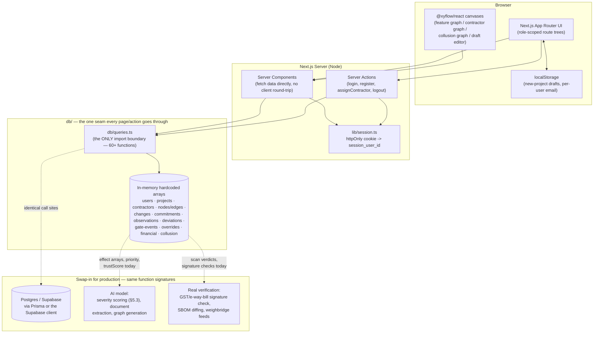
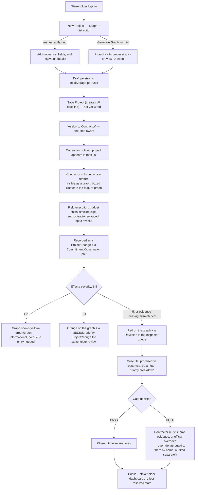

# PS : 
Public contracts are often evaluated in detail before award, but projects can change substantially during execution. Contractors or subcontractors may change, materials or costs may shift, and timelines or project details may be revised. When these changes are difficult to track against the original commitment, authorities may lack a clear view of whether the project remains aligned with what was approved and whether a change warrants further scrutiny. Design a system that gives stakeholders greater visibility into significant post-award changes and helps them understand their potential implications. The system should compare original commitments with subsequent project information and surface changes that may require review, intervention, or additional evidence. Teams may decide what constitutes a meaningful variation, how changes are detected and represented, how supporting evidence is connected, and how review priority is determined. The solution should support oversight without assuming that every change is improper.


# ANUBANDH — Solution Document

**अनुबंध (Anubandh)**: Sanskrit/Hindi for *contract, commitment, binding
agreement*. A public contract is a binding promise between the state and a
contractor; this system's whole job is watching what happens to that promise
after the ink dries.

---

## 1. The Problem Statement

**Track:** Smart Governance & Compliance — *"Unverified Post-Award
Subcontractor Variations"* (`manipal-PS.md`, line 97)

> Public contracts are often evaluated in detail before award, but projects
> can change substantially during execution. Contractors or subcontractors
> may change, materials or costs may shift, and timelines or project details
> may be revised. When these changes are difficult to track against the
> original commitment, authorities may lack a clear view of whether the
> project remains aligned with what was approved and whether a change
> warrants further scrutiny. Design a system that gives stakeholders greater
> visibility into significant post-award changes and helps them understand
> their potential implications. The system should compare original
> commitments with subsequent project information and surface changes that
> may require review, intervention, or additional evidence. Teams may decide
> what constitutes a meaningful variation, how changes are detected and
> represented, how supporting evidence is connected, and how review priority
> is determined. **The solution should support oversight without assuming
> that every change is improper.**

Three questions the brief explicitly leaves open, and our answers:

| Open question | Our answer |
|---|---|
| What constitutes a meaningful variation? | Every change is scored on a 1–5 **effect scale** against the node(s) it touches — AI-driven in the intended product, hand-authored per demo change in this prototype — see §5.3 |
| How are changes detected and represented? | A **project feature graph** (not a flat log) is the unit of truth; every change is a diff against that graph, browsable as its own graph at any point in time — see §4 |
| How is supporting evidence connected? | A **Commitment → Observation → Deviation** pipeline ties every promise to independently-sourced evidence, not contractor self-reporting — see §7 |
| How is review priority determined? | A deterministic priority number (spec section 46 of `project_coding_spec.md`) drives a cross-project **deviation queue**, sorted so officers see the worst case first — see §7.4 |
| Oversight without accusation | Nothing is ever labelled "fraud." Levels are named Cosmetic → Minor → Material → Critical → Integrity, and low-severity changes render calm and green, not alarming — see §5.3 |

---

## 2. The MVP, stated plainly

> **Track changes.**

Everything else in this document — the contractor hierarchy graph, the
commitment/evidence pipeline, the collusion graph, the financial triple-entry
view, the gate-scan screen — was brainstormed *around* that one MVP sentence,
to answer "okay, but track changes **for whom**, **using what evidence**, and
**with what consequence**?" The core, load-bearing feature is:

1. A project is represented as a **visual graph of features**, not a
   document.
2. Every graph has a **version history** — a chain of changes back to an
   original baseline.
3. Any two points in that history can be **compared**, and the comparison is
   rendered *on the graph itself* — nodes light up red→orange→yellow→green by
   how much they changed, not buried in a table.

Everything downstream (§6–§11) is the answer to "how do we know a given
change is worth 5/5 and not 1/5?" — in production, an AI model; in this
prototype, hand-authored numbers standing in for that model's output.

---

## 3. Roles and permissions

Three application-level roles, matching `project_coding_spec.md` §3:

```
STAKEHOLDER   — the awarding authority. Creates projects, awards the main
                contractor, reviews changes, sees the compliance layer.
CONTRACTOR    — the awarded party. Executes features, can subcontract work
                further down a chain of arbitrary depth.
INSPECTOR     — independent oversight. Sees every project (no
                inspector<->project link table exists yet), works the
                deviation queue, can override a gate but that override is
                permanently attributed to them by name.
```

A **subcontractor is not a fourth role** — it's a `Contractor` row whose
`parentContractorId` points at another contractor (§4.2). Because a
contractor's role (`MAIN_CONTRACTOR` vs. `SUBCONTRACTOR`) is recorded
*per project* in `project_contractors`, the same org can genuinely be a
subcontractor on one contract and the main contractor on a different,
unrelated one — the schema doesn't need a special case for that. (The demo
data doesn't currently show this with two independently-real projects; see
the callout in §4.2 about where this got faked for storytelling instead of
built properly.)

Each role gets its own route tree and its own collapsible global sidebar
(`app/{contractor,stakeholder,inspector}/...`), gated by a cookie session
(`lib/session.ts`) checked in each tree's top-level `layout.tsx`.

---

## 4. The project graph — the core visual model

### 4.1 What it is

Every project is a **DAG of feature nodes** (`PROJECT → FEATURE →
SUBFEATURE`), rendered with `@xyflow/react` and auto-laid-out with
`@dagrejs/dagre` (`lib/graph/layout.ts`) — no hand-placed coordinates
anywhere. The graph contains **features only**; contractor structure is a
completely separate graph (§4.2) linked only by IDs, per
`project_coding_spec.md` §9.

Edge direction is deliberately inverted from the "obvious" reading:
`source → target` means **"target depends on source."** A subfeature's edge
points *up* into its parent feature; a top-level feature's edge points *up*
into the project root. This one convention is what lets a single DAG encode
"the root is done when all its features are done" without a separate
containment table.

Because the root is the **sink** everything points into, it must render at
the *top* of the screen even though it's mathematically the last node in
rank order — solved by running dagre with `rankdir: "BT"` (bottom-to-top) so
the highest-rank node lands visually on top. The contractor hierarchy graph
(§4.2) has the *opposite* edge direction (parent → child) and therefore runs
`rankdir: "TB"` with the two node components' `@xyflow/react` `<Handle>`
types deliberately swapped. This is the single easiest thing to get backwards
in this codebase — get it wrong and edges loop around the sides of the boxes
instead of connecting cleanly.

Clicking a node opens a detail card (top-right) with its full record: name,
description, status, progress, due date, free-form metadata, who created it
and when, and (for a contractor session only) an **"Assign to other
contractor"** control listing every other real contractor except the viewer
— a no-op by design, there to *say* "this is where a contractor hands a
feature to a subcontractor" without actually performing the handoff in this
prototype.

Nodes assigned to a subcontractor are enclosed in a light dashed rectangle —
a real `@xyflow/react` parent/child group, so dragging the box moves the
whole delegated cluster together.

### 4.2 The contractor hierarchy — also a graph

Rather than a nested-JSON tree (the shape `IMPORTANT.md` originally sketched)
we use a **flat table with `parentContractorId`**, per
`project_coding_spec.md` §7 — the same pattern relational databases already
use for arbitrary-depth trees. `db/queries.ts#getProjectContractorTree`
computes an equivalent tree from that flat table on demand, so both
representations are available without picking one as "the" storage shape.

The stakeholder's **Contractor Details** tab renders this as a graph too:
main contractor at the top, each subcontractor positioned under whoever
brought them on, each node showing the features it's responsible for. Award
flow:



This directly encodes spec §5's rule: *"There should be no normal update
endpoint allowing a stakeholder to modify \[the awarded contractor]"* — the
award is a one-time transition out of `null`, never an edit afterward.

#### A prototype shortcut, named honestly — "the subcontractor's own project"

To make the demo readable — a subcontractor logging in and seeing *only* the
main contract's massive graph, with no sense of "this is my piece of it," is
a bad demo moment — the dataset includes a second project record
(`project-5`, "Electrical & Signaling System") that ElectroWorks sees as its
own project. **This is a fabricated, unlinked duplicate**: a separate
`Project` row with a separate, hand-copied slice of nodes, connected to the
real project only by a cosmetic `partOfProjectId` label that prints "part of
Riverside Metro Extension" in the header. No node, edge, ID, or query
actually ties it back — deleting `project-5` would not change `project-1` at
all.

That is **not** the intended design, and we don't want it read as one. The
real design needs no new entity at all: `db/queries.ts` already has
`getFeatureAssignmentsForContractor(projectId, contractorId)`, which returns
exactly the subset of the shared graph a given contractor is responsible
for. "A subcontractor's project" should be that query rendered as its own
dashboard — a **filtered view into the one real graph**, with its own
progress/status roll-up and a live link back to the parent project — not a
second copy of the data. We hardcoded the shortcut instead of building that
view under hackathon time pressure; it's flagged here so it reads as a
known gap, not as the architecture.

### 4.3 Creating a project — list + graph + AI

A stakeholder builds a brand-new project's feature tree two ways, kept in
sync in one screen (`/stakeholder/new-project`):

- **Graph tab** — the same React Flow canvas, but editable: every node has a
  hover "+" to add a child directly on the canvas, and a collapse toggle that
  hides a subtree and shows *how many* nodes are hidden as a badge.
- **List tab** — the identical tree as a file-explorer: a node with children
  is a folder (expand/collapse), a leaf is a file. Both tabs share one
  selection state and one editing sidebar — switching tabs is a pure CSS
  toggle (`hidden` class), so nothing remounts, refetches, or loses state.
- **Generate Graph with AI** — a two-stage modal. Stage 1: describe the
  project in a text box, optionally tick "tag the current graph" to have the
  AI *edit* what's already there instead of replacing it. Stage 2: the
  generated graph is rendered **inside the popup itself** for review before
  it touches the real working area — three buttons, *Back* (retry the
  prompt), *Cancel* (discard), *Insert into working area* (commit it). In
  this prototype the "AI" is a hardcoded response after a staged 2-second
  delay; the interaction contract (prompt → preview → confirm) is exactly
  what a real model call would slot into.

The whole draft lives in browser `localStorage`, keyed by the user's email,
loaded on open and mirrored on every edit — a stakeholder can close the tab
mid-draft and pick up exactly where they left off. **Save Project** is
deliberately not wired to anything yet (the seam is there — the draft's tree
shape is a straightforward mapping onto `GraphNode`/`GraphEdge` once that's
built); **Reset** is fully functional and clears the draft.

Deliberately **no status or progress fields exist on a draft node** — those
only mean something once a contractor has been awarded and execution has
begun. A project still being drafted hasn't been awarded to anyone yet, so
there is nothing "in progress."

---

## 5. Change tracking and the severity/effect model — the actual MVP

### 5.1 The version chain

Per spec §15–16, changes are **append-only**: `v0` is the original baseline,
and every subsequent change creates a new version pointing at its parent.
Nothing is ever overwritten; the "current" state is just the tip of the
chain.

### 5.2 The 5-step change history

On the Project Graph screen, below the canvas, a **Change history** list
shows the most recent chain of changes for that project — index 0 is the
latest, the last entry is the **Original** baseline itself. Each entry
carries: what changed, who changed it, when, and which node(s) it touched.

Two buttons sit top-left of the graph canvas:

- **Compare with Original** — colours every node by the *worst* (maximum)
  severity it experienced across the *entire* chain. A node changed multiple
  times shows its single most dramatic hit, not an average.
- **Compare with Last Change** — colours nodes using only the most recent
  step (`index 0`).

Clicking **any entry in the list** does the same thing for *that* step alone
— literally "show me the graph at that point in time." The two buttons and
the list share one piece of state, so clicking "Compare with Last Change" and
clicking the topmost list row are the same action and highlight the same way.

The mechanism (the toggle, the per-node colouring, the click-through) is real
code that runs against whatever data it's given. The 5-entry chain itself is
only hand-authored for `project-1` right now — the other three demo projects
don't have one yet, so the buttons and list simply don't render for them.
Wiring every project up to real `ProjectChange`/`ProjectVersion` records
(which already exist in the schema, §5.1) is what makes this general.



### 5.3 Who decides "dramatic" vs "no effect"? — the effect array

> *"who decides what is dramatic and what is no effect change — we gonna use
> AI in actual build but for prototype: create another array."*

That's exactly the seam we built. `lib/graph/change-history.ts` hardcodes a
second array, index-aligned with the change list:

```ts
type NodeChangeEffect = { nodeId: string; effect: number }; // 1-5, never 0
const effects: NodeChangeEffect[][] = [
  [ {nodeId: "...", effect: 5}, {nodeId: "...", effect: 2} ], // step 0
  [ ... ],                                                     // step 1
  [ ... ],                                                     // step 2
  [ ... ],                                                     // step 3
  [ ... ],                                                     // step 4 (Original)
];
```

`effect` is never `0` — a node absent from a step's array simply wasn't
touched by it (0 would mean "no change," and a no-change isn't stored as a
change record at all). Colour mapping (`lib/graph/severity-color.ts`):

| Effect | Meaning | Colour |
|---|---|---|
| 5 | Dramatic | Red |
| 4 | Significant | Dark orange |
| 3 | Moderate | Orange |
| 2 | Minor | Yellow |
| 1 | No real effect (but still technically a change) | Yellow-green |
| *(absent)* | No change at all to this node | Green |

In production this array is exactly what a model call fills in — given the
before/after state of a node (and, per spec §46's deterministic scoring
algorithm as a sanity-checkable baseline: budget swing %, timeline slip,
subcontractor change, missing evidence), the model returns a 1–5 effect per
affected node instead of a hackathon author typing it in by hand.

### 5.4 What "a change" actually covers

The data model (`types/change.ts`) already spans every category named in the
brief:

```
NODE_CREATED · NODE_DELETED · NODE_UPDATED   (feature-detail change)
EDGE_CREATED · EDGE_DELETED                  (feature/dependency change)
CONTRACTOR_ASSIGNED · SUBCONTRACTOR_CHANGED  (sub-contractor change)
BUDGET_CHANGED                               (budget change)
TIMELINE_CHANGED                             (timeline change)
STATUS_CHANGED · PROGRESS_CHANGED
```

The demo dataset includes real examples of most of these on `project-1`: a
subcontractor swap (CableWorks → ElectroWorks), a timeline slip (precast
delivery), and a pending budget increase — each with its own `ChangeReview`
(who approved/rejected it) and `ChangeRiskScore` (the deterministic priority
number from spec §46, kept *separate* from the graph-severity array in §5.3
— one scores the *change record*, the other colours the *graph* — same
underlying idea, two different rendering surfaces).

### 5.5 Domain-agnostic by construction

`GraphNode.metadata` is a free-form key/value bag (both key *and* value
user-editable in the new-project editor), specifically so the same schema
works whether the "material" field says `"Fe500 steel"` or a software
project's node says `"technology": "OAuth2"`. `project-4`, a citizen-services
software contract, runs through the *exact same* screens — deviation queue,
case file, gate scan, financial view — as `project-1`'s hospital construction,
with zero domain-specific branching in any component. That cross-domain proof
is deliberate: the brief never restricts "post-award variation" to
construction.

---

## 6. Notifications

Every user-generated change is meant to notify other project participants
except the inspector (spec §22, `IMPORTANT.md`). The mechanism exists and is
wired for the one action that currently fires it — awarding a contractor
pushes a real notification into that contractor's inbox — and the same
`createNotification`/`getNotificationsForUser` pair is ready for every other
mutation to call into as those get built out.

---

## 7. The compliance layer — how a "meaningful variation" gets caught

This is the part of the brief asking *"how are changes detected... how is
evidence connected... how is review priority determined"* — answered as a
five-stage pipeline, all under `db/` as hand-authored records with clear
comments that nothing here is computed (an explicit prototype rule — see §10).



### 7.1 Commitment — the original promise

A `Commitment` restates one clause of the contract in plain language, tied to
a specific graph node: *"Steel reinforcement must be Fe500 grade,"*
*"Sand must come from Quarry Q-114,"* *"Electrical work is subcontracted to
ElectroWorks."* Each carries a **criticality** (Cosmetic / Financial /
Identity / Structural / Safety) and a **tolerance band** (None / Tight /
Loose / Cosmetic) — the paint-colour commitment and the steel-grade
commitment are treated completely differently downstream *because* of these
two fields, not because paint and steel are hardcoded as special cases.

### 7.2 Observation — evidence that doesn't come from the contractor

The system deliberately favours sources the contractor **cannot author
themselves**: a government-signed GST e-invoice QR code, a weighbridge
reading, a bank payment record, an equipment GPS ping, a lab certificate. A
site photo submitted by the contractor is explicitly labelled lower-trust —
*"corroboration only."* Every observation carries a `trustScore` and a
plain-language `trustLabel` so a reviewer always sees *why* a given piece of
evidence is or isn't convincing, never a bare "verified ✓."

### 7.3 Deviation — where promise and evidence disagree

A `Deviation` is what happens when an `Observation` contradicts its
`Commitment` (**MISMATCH**), or an `Expectation` never gets satisfied at all
(**SILENCE** — arguably the more interesting failure mode: *nobody reported
anything*, which a simple "flag if it looks wrong" system would never catch).
A third kind, **PROMOTED**, rolls up many small, individually-harmless
deviations into one — the demo's canonical example is 14 cosmetic finish
downgrades that, taken together, add up to a real ₹18.2L material
substitution nobody would have flagged one at a time.

Five severity levels, deliberately named to avoid "fraud" framing:

```
L0  Cosmetic     — calm, informational
L1  Minor        — calm, informational
L2  Material     — a caution
L3  Critical     — unmistakably urgent
L4  Integrity    — unmistakably urgent
```

### 7.4 Review priority — worked, not asserted

Per spec §46, priority is a **deterministic, inspectable formula**, not a
black-box score:

```
score = 0
if budgetIncreasePercent > 20:     score += 30
if deadlineExtensionMonths > 6:    score += 20
if subcontractorChanged:           score += 25
if majorFeatureRemoved:            score += 30
if evidenceMissing:                score += 25
if repeatedChanges:                score += 15

0–29  LOW · 30–59 MEDIUM · 60+ HIGH
```

Every deviation's `priorityFactors` array renders this breakdown visibly —
*"criticality STRUCTURAL ×4.0, magnitude 1.0, value at risk ₹1.42 Cr,
recurrence ×1.2, ÷ 3.8 hours remaining = 91.4"* — so a priority number never
reads as an opaque AI verdict; it always shows its work. The cross-project
**deviation queue** (`/inspector/deviations`) is this priority order made
literal: cosmetic cases hidden by default (with a note that an
undifferentiated list is exactly what causes real deviations to get missed
in the noise), the worst case always on top.

### 7.5 Gate events and the override chain

A **gate event** is a go/no-go checkpoint tied to a node — most dramatically
at an *irreversible* moment (`irreversibleEvent: "CONCRETE_POUR"`,
`"Pour at 12:00 today"`), where a `HOLD` actually matters because the
decision can't be undone once the concrete sets. An inspector can override a
`HOLD`, but the override screen is built around one idea: **the override
itself becomes the audit target.** It's permanently attributed to the
logged-in officer by name, and a separate **override-audit** page tallies
overrides per officer — because a system that only watches contractors and
never watches its own reviewers has just moved the fraud channel one level
up.

### 7.6 The gate-scan screen — offline field verification

A contractor-facing screen (`/contractor/project/[id]/gate-scan`) plays back
what scanning a real invoice/e-way-bill QR or an SBOM would produce:
signature check → decoded payload → a pass/fail checklist → the resulting
gate decision, revealed in stages so it reads as a real process. Three
scripted scenarios cover the demo's clearest fraud pattern: an approved
quarry (clean), a wrong supplier GSTIN (material-source mismatch → `HOLD`),
and a mismatched recipient GSTIN (diversion). A parallel scenario set for
`project-4` swaps the invoice payload for an SBOM (software bill of
materials) at the production-deploy checkpoint — same mechanism, different
domain.

### 7.7 Financial triple-entry view

Money, material, and labour are tracked as three *independent* signals per
period. The headline number is the **claim gap** — claimed progress (38%)
against independently observed progress (19%) — drawn as two diverging line
curves. The triple-entry table flags the pattern that matters most: a period
where **money moved and material was delivered, but no corresponding work
was observed** — the single clearest indicator that a paper trail exists
without physical progress behind it.

### 7.8 Collusion graph

A third graph type (deliberately *not* hierarchical — vendor relationships
cluster rather than rank, so it uses a relational layout, not `dagre`'s
top-down ranking). It surfaces relationships between contractors that would
never appear in an org chart: a shared director, a shared registered address,
a shared bank account, a firm incorporated suspiciously close to a tender
date, and — the strongest signal in the dataset — a bidder who *lost* the
tender reappearing later as an undisclosed subcontractor on the winning bid.

### 7.9 Public transparency

An unauthenticated `/public/[projectId]` page — deliberately outside all
three role trees, no login required — shows a citizen-facing summary:
project name, awarding authority, committed-vs-verified counts, how many
open Critical/Integrity cases exist, and a last-verified date. It never
names a party or exposes raw evidence. A visible "report a concern" form
makes clear that a citizen report can *open* a case, but a citizen can never
*close* one themselves.

---

## 8. Architecture



**Why this shape matters for a hackathon judge:** every page and server
action imports *only* from `db/queries.ts`, never from the raw arrays
directly. That means the entire hardcoded prototype can be replaced by a real
database and a real model behind that one file, without touching a single
page component. This isn't aspirational — it's the actual rule the team
worked under (see `plan.md/update (1).md`'s global rule 3: *"No backend...
everything is an in-memory array under `db/`, in the same style as the
existing files"* and rule 5: *"additive only... you may add new functions"*).

### Tech stack

| Layer | Choice |
|---|---|
| Framework | Next.js 16 (App Router, Turbopack), React 19, TypeScript |
| Styling | Tailwind CSS v4 |
| Graph rendering | `@xyflow/react` (React Flow) — feature graph, contractor graph, collusion graph, draft editor |
| Auto-layout | `@dagrejs/dagre` — real hierarchical layout (rank + crossing-minimization), not hand-placed coordinates |
| Icons | `lucide-react` |
| Auth | Cookie-based session (`httpOnly`), no third-party provider yet |
| Data | In-memory TypeScript arrays under `db/`, one query-function seam (`db/queries.ts`) |
| Persistence (drafts only) | Browser `localStorage`, keyed per user email |

### Route structure (abridged)

```
app/
├── login/, page.tsx              (landing page IS the login/register form)
├── contractor/
│   ├── projects/, profile/, settings/, notifications/
│   └── project/[projectId]/
│       dashboard · daily-reports · project-graph · stakeholder-details ·
│       subcontractors · changes · gate-scan · bill-scan · bills ·
│       notifications · settings
├── stakeholder/
│   ├── projects/, new-project/, profile/, settings/, notifications/
│   └── project/[projectId]/
│       dashboard · daily-reports · project-graph · contractor-details ·
│       changes · financial · commitments · bill-scan · bills ·
│       notifications · settings
├── inspector/
│   ├── projects/, deviations/, override-audit/, collusion/, profile/, settings/, notifications/
│   └── project/[project_id]/          <- snake_case here, deliberately
│       changes · graph · deviations · deviations/[deviationId] ·
│       expectations · financial · timeline · evidence · gate/[id]/override ·
│       bill-scan · bills
└── public/[projectId]/                <- outside all three role trees, no auth
```

Route param casing is *intentionally* inconsistent (`[projectId]` for
contractor/stakeholder, `[project_id]` for inspector) — a preserved artifact
of how the structure was originally specified, called out explicitly so
nobody "fixes" it and breaks the tree they didn't mean to touch.

---

## 9. End-to-end user flow



---

## 10. What's real vs. what's hardcoded — read this before demoing

This is a hackathon prototype, and honesty about the boundary matters more
than pretending everything is live. Nothing here computes a severity, a
priority, a countdown, or a verification result — every one of those is a
field hand-typed into a `db/*.ts` file (an explicit, enforced rule the
project was built under). What **is** real, working code:

| Real and working | Hardcoded for the demo |
|---|---|
| Graph rendering, layout, drag, collapse | Effect/severity numbers (§5.3) |
| Node create/edit/delete in the new-project editor | Deviation levels, priorities, `timeRemaining` strings |
| Contractor award flow + one-time lock | Signature/GST/e-way-bill verification results |
| Route-level access control per role | Trust scores on observations |
| Notification creation + inbox | Financial curves, claim gap, CPI |
| localStorage draft persistence | Collusion findings and their severities |
| The `db/queries.ts` data-access seam | Override hash/prevHash chain values |
| The two-stage AI-generation *interaction* (prompt → preview → insert) | The AI's actual output (same canned graph every time) |
| `getFeatureAssignmentsForContractor` (the real query a subcontractor-scoped view needs) | "ElectroWorks' own project" (`project-5`) — a fully separate, unlinked demo record faking that view; see the callout in §4.2 |

The seam in every "hardcoded" row above is exactly where a real model call or
a real verification API slots in later — the interaction, the data shape,
and every screen that renders it are already built and waiting.

---

## 11. Demo running order

1. **Commitment review** (`/stakeholder/project/[id]/commitments`) — "this is
   the only point a human configures the system, and it takes ~10 minutes
   per contract."
2. **Gate scan, approved quarry** (`/contractor/project/[id]/gate-scan`) —
   clean PASS.
3. **Gate scan, wrong supplier** — same screen, HOLD, "3h 49m" remaining.
4. **Inspector deviation queue** (`/inspector/deviations`) — the HOLD at the
   top, cosmetic cases hidden by default.
5. **Case file** — promised vs. observed, trust note, priority breakdown.
6. **Expectations** — the missing lab certificate (a SILENCE case).
7. **Financial** — the 19-point claim gap, the diverging curves.
8. **Collusion graph** — the losing bidder reappearing as a subcontractor.
9. **Switch to `project-4`** (a software contract) — same screens, zero
   domain-specific code.
10. **Override** — named accountability, then the audit page.
11. **Project Graph — Compare with Original** — the MVP, last: the whole
    pipeline above exists to answer *why* a given node is red.

---

## 12. Where this goes next

- Wire `Save Project` so the new-project editor actually creates a
  `GraphNode`/`GraphEdge` set (the tree shape already maps cleanly).
- Replace the hardcoded effect array (§5.3) with a real model call scoring
  actual before/after diffs.
- Replace scripted scan scenarios with real GST/e-way-bill signature
  verification and SBOM diffing.
- Persist `db/` to a real database — every function in `db/queries.ts` is
  already the exact seam a Prisma/Supabase client would sit behind.
- Extend notifications to fire on every mutation, not just contractor award,
  per the spec's "every change notifies every user except the inspector"
  rule.
- Server-side permission enforcement beyond route-level role checks
  (OWNER/EDITOR/VIEWER distinctions, "a contractor can't touch a contractor
  above it in the chain").
